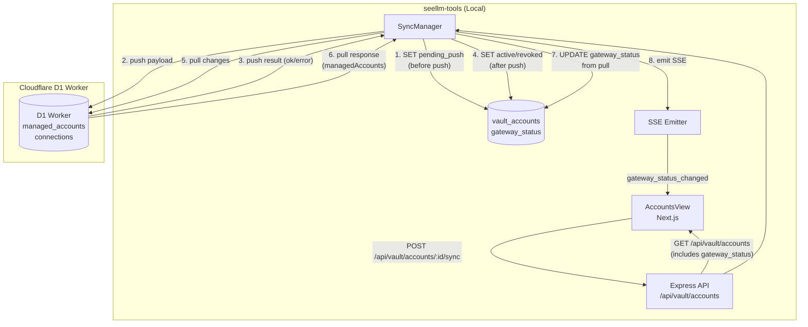
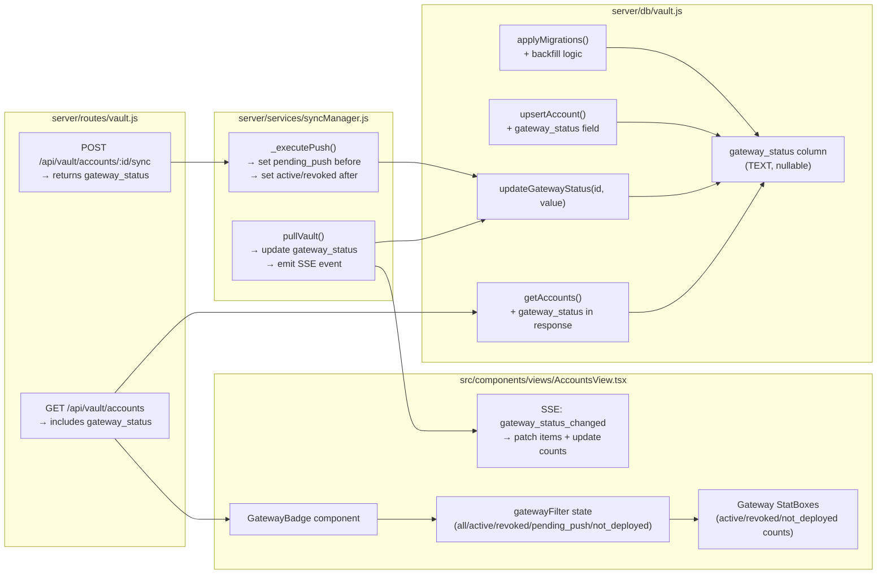
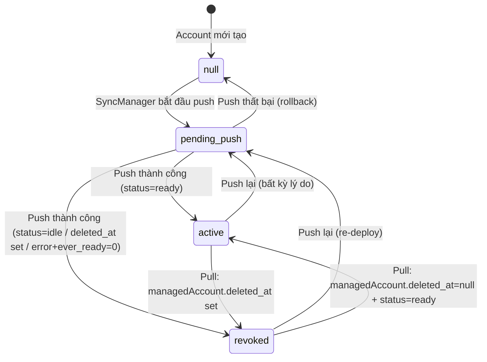

# Design Document — Account Gateway Visibility

## Overview

Feature này bổ sung một lớp **Gateway Visibility** vào seellm-tools, cho phép người dùng nhìn vào danh sách tài khoản và biết ngay trạng thái thực tế của từng tài khoản trên seellm-gateway mà không cần tra cứu thủ công.

Giải pháp gồm bốn phần phối hợp:

1. **Cột `gateway_status` trong SQLite** — nguồn sự thật duy nhất về trạng thái Gateway của mỗi tài khoản.
2. **SyncManager cập nhật `gateway_status`** — tự động ghi nhận kết quả push/pull vào cột này.
3. **SSE event `gateway_status_changed`** — thông báo realtime cho UI khi trạng thái thay đổi.
4. **UI badge + filter + StatBox** — hiển thị và lọc theo `gateway_status` trong AccountsView.

---

## Architecture

### High-Level Data Flow



### Component Diagram



---

## Components and Interfaces

### 1. `vault.updateGatewayStatus(id, value)` — New helper

Hàm tiện ích mới trong `server/db/vault.js` để cập nhật `gateway_status` một cách an toàn:

```js
/**
 * Cập nhật gateway_status cho một account.
 * @param {string} id - Account ID
 * @param {'pending_push'|'active'|'revoked'|null} value
 */
updateGatewayStatus(id, value) {
  const VALID = new Set(['pending_push', 'active', 'revoked', null]);
  if (!VALID.has(value)) {
    console.warn(`[Vault] Invalid gateway_status value: ${value}`);
    return;
  }
  const now = dayjs().toISOString();
  db.prepare(
    'UPDATE vault_accounts SET gateway_status = ?, updated_at = ? WHERE id = ?'
  ).run(value, now, id);
}
```

### 2. `SyncManager._executePush()` — Modified

Thêm ba điểm cập nhật `gateway_status`:

| Thời điểm | Hành động |
|-----------|-----------|
| Trước khi gọi D1 Worker | `updateGatewayStatus(id, 'pending_push')` |
| Push thành công + `status='ready'` | `updateGatewayStatus(id, 'active')` |
| Push thành công + `status='idle'` hoặc `deleted_at` set | `updateGatewayStatus(id, 'revoked')` |
| Push thành công + error status + `ever_ready=1` | Giữ nguyên `'active'` (không ghi đè) |
| Push thành công + error status + `ever_ready=0` | `updateGatewayStatus(id, 'revoked')` |
| Push thất bại (D1 error) | Không thay đổi (rollback `pending_push` về giá trị trước) |

### 3. `SyncManager.pullVault()` — Modified

Sau khi merge `managedAccounts`, thêm logic cập nhật `gateway_status` và emit SSE:

```js
// Sau vòng lặp merge managedAccounts:
const changedIds = [];
for (const ga of gatewayAccounts) {
  const existing = /* tìm account tương ứng */;
  if (!existing) continue;
  
  let newGatewayStatus = existing.gateway_status;
  if (ga.deleted_at) {
    newGatewayStatus = 'revoked';
    // KHÔNG set deleted_at trên vault account
  } else if (ga.status === 'ready' && !ga.deleted_at) {
    newGatewayStatus = 'active';
  }
  
  if (newGatewayStatus !== existing.gateway_status) {
    vault.updateGatewayStatus(existing.id, newGatewayStatus);
    existing.gateway_status = newGatewayStatus;
    changedIds.push(existing.id);
  }
}

if (changedIds.length > 0 && emitSSE) {
  emitSSE('gateway_status_changed', { ids: changedIds });
}
```

### 4. `GatewayBadge` component — New React component

```tsx
type GatewayStatus = 'active' | 'revoked' | 'pending_push' | null;

interface GatewayBadgeProps {
  gatewayStatus: GatewayStatus;
}

function GatewayBadge({ gatewayStatus }: GatewayBadgeProps) {
  // null → "Chưa deploy" (slate)
  // 'pending_push' → "Đang đồng bộ" (indigo + spinner)
  // 'active' → "Trên Gateway" (emerald + Globe icon)
  // 'revoked' → "Đã thu hồi" (amber)
}
```

### 5. API Response Shape — Modified

`GET /api/vault/accounts` response item:

```json
{
  "id": "acc_abc123",
  "email": "user@example.com",
  "status": "ready",
  "gateway_status": "active",
  ...
}
```

`POST /api/vault/accounts/:id/sync` response:

```json
{
  "ok": true,
  "gateway_status": "active"
}
```

---

## Data Models

### SQL Migration

Thêm vào `applyMigrations()` trong `server/db/vault.js`:

```sql
-- Migration: Thêm cột gateway_status
ALTER TABLE vault_accounts ADD COLUMN gateway_status TEXT DEFAULT NULL;

-- Backfill: Gán giá trị ban đầu dựa trên (ever_ready, status)
UPDATE vault_accounts
SET gateway_status = CASE
  WHEN ever_ready = 1 AND status = 'ready' THEN 'active'
  WHEN ever_ready = 1 AND status = 'idle'  THEN 'revoked'
  ELSE NULL
END
WHERE gateway_status IS NULL;
```

Migration được bọc trong `try/catch` theo pattern hiện có — nếu cột đã tồn tại thì bỏ qua.

### Vault_Account Schema (sau migration)

| Cột | Kiểu | Mặc định | Mô tả |
|-----|------|----------|-------|
| `gateway_status` | TEXT | NULL | Trạng thái trên Gateway: `null`, `'pending_push'`, `'active'`, `'revoked'` |

Các cột khác giữ nguyên.

### Gateway Status State Machine



### SSE Event Schema

```ts
// Event: 'gateway_status_changed'
interface GatewayStatusChangedEvent {
  ids: string[];  // Danh sách account ID có gateway_status thay đổi
}
```

---

## Correctness Properties

*A property is a characteristic or behavior that should hold true across all valid executions of a system — essentially, a formal statement about what the system should do. Properties serve as the bridge between human-readable specifications and machine-verifiable correctness guarantees.*

### Property 1: gateway_status chỉ nhận giá trị hợp lệ

*For any* account record được lưu vào Vault, trường `gateway_status` phải thuộc tập hợp `{null, 'pending_push', 'active', 'revoked'}` — không bao giờ là giá trị tùy tiện khác.

**Validates: Requirements 1.2, 6.2**

---

### Property 2: Backfill migration nhất quán với (ever_ready, status)

*For any* tập hợp account records với các giá trị `(ever_ready, status)` tùy ý, sau khi chạy migration backfill, `gateway_status` phải bằng `'active'` khi `ever_ready=1 AND status='ready'`, bằng `'revoked'` khi `ever_ready=1 AND status='idle'`, và `null` trong mọi trường hợp còn lại.

**Validates: Requirements 1.5**

---

### Property 3: Push thành công cập nhật gateway_status đúng theo status

*For any* account với bất kỳ `status` nào, sau khi SyncManager push thành công lên D1, `gateway_status` phải phản ánh đúng kết quả: `'active'` nếu `status='ready'`, `'revoked'` nếu `status='idle'` hoặc `deleted_at` set hoặc (`status` thuộc error-group và `ever_ready=0`), và giữ nguyên `'active'` nếu `status` thuộc error-group và `ever_ready=1`.

**Validates: Requirements 2.1, 2.2, 2.5, 2.6, 2.7**

---

### Property 4: Push thất bại không thay đổi gateway_status

*For any* account với bất kỳ `gateway_status` ban đầu nào, nếu SyncManager nhận lỗi từ D1 Worker khi push, `gateway_status` phải giữ nguyên giá trị trước đó (không bị ghi đè bởi `'pending_push'` hay bất kỳ giá trị nào khác).

**Validates: Requirements 2.4**

---

### Property 5: Pull cập nhật gateway_status nhất quán với deleted_at của managedAccount

*For any* tập hợp `managedAccounts` nhận được từ D1 pull, với bất kỳ tổ hợp `(deleted_at, status)` nào, `gateway_status` của Vault_Account tương ứng phải bằng `'revoked'` khi `managedAccount.deleted_at` được set, và bằng `'active'` khi `managedAccount.deleted_at=null AND status='ready'`.

**Validates: Requirements 3.1, 3.3, 3.4**

---

### Property 6: Gateway Revocation không set deleted_at trên Vault_Account

*For any* gateway revocation event (managedAccount.deleted_at set trong pull response), `deleted_at` trên Vault_Account tương ứng phải giữ nguyên giá trị ban đầu — không bao giờ bị ghi đè bởi quá trình cập nhật `gateway_status`.

**Validates: Requirements 3.2**

---

### Property 7: SSE event chứa đúng danh sách account ID bị thay đổi

*For any* chu kỳ pull có K accounts thay đổi `gateway_status`, SSE event `gateway_status_changed` phải được emit với danh sách chứa đúng K account ID đó — không thiếu, không thừa.

**Validates: Requirements 3.5**

---

### Property 8: GatewayBadge render đúng theo gateway_status

*For any* account với bất kỳ `gateway_status` nào trong tập hợp hợp lệ, `GatewayBadge` phải render đúng label và color class tương ứng: `null` → "Chưa deploy" (slate), `'pending_push'` → "Đang đồng bộ" (indigo), `'active'` → "Trên Gateway" (emerald), `'revoked'` → "Đã thu hồi" (amber).

**Validates: Requirements 4.1, 4.2, 4.3, 4.4**

---

### Property 9: Gateway filter trả về đúng tập con accounts

*For any* danh sách accounts với các `gateway_status` hỗn hợp, áp dụng bộ lọc `gatewayFilter` phải trả về đúng tập con: `'active'` → chỉ accounts có `gateway_status='active'`, `'revoked'` → chỉ `gateway_status='revoked'`, `'not_deployed'` → chỉ `gateway_status=null`. Kết hợp với `statusFilter` phải cho kết quả là giao của hai bộ lọc (AND logic).

**Validates: Requirements 5.2, 5.3, 5.4, 5.5**

---

### Property 10: StatBox counts khớp với danh sách accounts hiện tại

*For any* danh sách accounts được load vào AccountsView, các StatBox gateway phải hiển thị đúng số lượng: `count(gateway_status='active')`, `count(gateway_status='revoked')`, `count(gateway_status=null)` — nhất quán với danh sách đang hiển thị.

**Validates: Requirements 7.1, 7.2**

---

## Error Handling

### Push Failure — Rollback gateway_status

Khi `_executePush()` gặp lỗi từ D1 Worker:

1. `gateway_status` đã được set thành `'pending_push'` trước khi push.
2. Cần rollback về giá trị trước đó.
3. **Giải pháp**: Đọc `gateway_status` hiện tại từ DB trước khi set `'pending_push'`, lưu vào biến `previousGatewayStatus`. Nếu push thất bại, gọi `updateGatewayStatus(id, previousGatewayStatus)`.

```js
// Trong _executePush():
const currentAccount = vault.db.prepare(
  'SELECT gateway_status FROM vault_accounts WHERE id = ?'
).get(data.id);
const previousGatewayStatus = currentAccount?.gateway_status ?? null;

// Set pending_push
vault.updateGatewayStatus(data.id, 'pending_push');

try {
  const res = await fetch(...);
  // ... xử lý kết quả
  vault.updateGatewayStatus(data.id, newStatus);
} catch (e) {
  // Rollback
  vault.updateGatewayStatus(data.id, previousGatewayStatus);
  console.error(`[SyncManager] ❌ Error syncing ${type}:`, e.message);
}
```

### Pull — Account không tìm thấy trong Vault

Nếu `managedAccount` từ D1 không match với bất kỳ Vault_Account nào (by ID hoặc email), bỏ qua việc cập nhật `gateway_status` — không tạo record mới chỉ để set gateway_status.

### SSE Emitter chưa được inject

`pullVault()` được gọi từ nhiều context. Nếu `emitSSE` chưa được inject (null), bỏ qua emit — không throw error.

```js
if (changedIds.length > 0 && typeof emitSSE === 'function') {
  emitSSE('gateway_status_changed', { ids: changedIds });
}
```

### Migration — Cột đã tồn tại

Theo pattern hiện có trong `applyMigrations()`, bọc `ALTER TABLE` trong `try/catch`:

```js
try {
  db.exec(`ALTER TABLE vault_accounts ADD COLUMN gateway_status TEXT DEFAULT NULL`);
  // Backfill chỉ chạy sau khi ALTER thành công
  db.exec(`UPDATE vault_accounts SET gateway_status = CASE ...`);
} catch (e) {
  // Cột đã tồn tại — bỏ qua
}
```

---

## Testing Strategy

### Unit Tests (Example-based)

| Test | Mô tả |
|------|-------|
| `vault.updateGatewayStatus` với giá trị hợp lệ | Verify DB được cập nhật đúng |
| `vault.updateGatewayStatus` với giá trị không hợp lệ | Verify không ghi vào DB, log warning |
| Account mới tạo có `gateway_status = null` | Verify default value |
| Migration backfill trên DB có sẵn | Verify cột được thêm, dữ liệu không mất |
| `GET /api/vault/accounts` trả về `gateway_status` | Verify field có trong response |
| `POST /api/vault/accounts/:id/sync` trả về `gateway_status` mới | Verify response shape |

### Property-Based Tests

Sử dụng **fast-check** (TypeScript/JavaScript PBT library). Mỗi property test chạy tối thiểu **100 iterations**.

Tag format: `Feature: account-gateway-visibility, Property {N}: {property_text}`

#### Property 1 — gateway_status chỉ nhận giá trị hợp lệ

```ts
// Feature: account-gateway-visibility, Property 1: gateway_status only accepts valid values
fc.assert(fc.property(
  fc.string(), // arbitrary gateway_status value
  (value) => {
    const VALID = new Set([null, 'pending_push', 'active', 'revoked']);
    vault.updateGatewayStatus(testAccountId, value as any);
    const result = db.prepare('SELECT gateway_status FROM vault_accounts WHERE id = ?').get(testAccountId);
    return VALID.has(result.gateway_status);
  }
), { numRuns: 100 });
```

#### Property 2 — Backfill migration nhất quán

```ts
// Feature: account-gateway-visibility, Property 2: backfill consistent with (ever_ready, status)
fc.assert(fc.property(
  fc.record({
    ever_ready: fc.integer({ min: 0, max: 1 }),
    status: fc.constantFrom('idle', 'ready', 'pending', 'error', 'relogin', 'need_phone'),
  }),
  ({ ever_ready, status }) => {
    // Insert account, run backfill, check gateway_status
    const expected =
      ever_ready === 1 && status === 'ready' ? 'active' :
      ever_ready === 1 && status === 'idle'  ? 'revoked' : null;
    // ... verify
    return result.gateway_status === expected;
  }
), { numRuns: 100 });
```

#### Property 3 — Push thành công cập nhật gateway_status đúng

```ts
// Feature: account-gateway-visibility, Property 3: successful push sets correct gateway_status
fc.assert(fc.property(
  fc.record({
    status: fc.constantFrom('ready', 'idle', 'error', 'need_phone', 'relogin'),
    ever_ready: fc.integer({ min: 0, max: 1 }),
    deleted_at: fc.option(fc.constant(new Date().toISOString()), { nil: null }),
  }),
  async ({ status, ever_ready, deleted_at }) => {
    // Mock D1 fetch to return success
    // Run _executePush with mocked fetch
    // Verify gateway_status matches expected mapping
  }
), { numRuns: 100 });
```

#### Property 4 — Push thất bại không thay đổi gateway_status

```ts
// Feature: account-gateway-visibility, Property 4: failed push preserves gateway_status
fc.assert(fc.property(
  fc.constantFrom(null, 'pending_push', 'active', 'revoked'),
  async (initialGatewayStatus) => {
    // Set initial gateway_status
    // Mock D1 fetch to throw error
    // Run _executePush
    // Verify gateway_status unchanged
  }
), { numRuns: 100 });
```

#### Property 5 — Pull cập nhật gateway_status nhất quán

```ts
// Feature: account-gateway-visibility, Property 5: pull updates gateway_status consistently
fc.assert(fc.property(
  fc.array(fc.record({
    id: fc.string(),
    email: fc.emailAddress(),
    deleted_at: fc.option(fc.constant(new Date().toISOString()), { nil: null }),
    status: fc.constantFrom('ready', 'idle', 'error'),
  })),
  async (managedAccounts) => {
    // Mock D1 pull response with managedAccounts
    // Run pullVault
    // Verify each vault account's gateway_status matches rule
  }
), { numRuns: 100 });
```

#### Property 6 — Gateway Revocation không set deleted_at

```ts
// Feature: account-gateway-visibility, Property 6: revocation never sets deleted_at
fc.assert(fc.property(
  fc.option(fc.constant(new Date().toISOString()), { nil: null }), // initial deleted_at
  async (initialDeletedAt) => {
    // Set up vault account with initialDeletedAt
    // Mock pull with managedAccount.deleted_at set
    // Run pullVault
    // Verify vault account's deleted_at unchanged
  }
), { numRuns: 100 });
```

#### Property 7 — SSE event chứa đúng account IDs

```ts
// Feature: account-gateway-visibility, Property 7: SSE event contains exactly changed account IDs
fc.assert(fc.property(
  fc.array(fc.record({ id: fc.string(), gatewayStatusChanged: fc.boolean() }), { minLength: 1 }),
  async (accounts) => {
    const expectedIds = accounts.filter(a => a.gatewayStatusChanged).map(a => a.id);
    // Mock pull response
    // Capture SSE emissions
    // Verify emitted IDs === expectedIds
  }
), { numRuns: 100 });
```

#### Property 8 — GatewayBadge render đúng

```ts
// Feature: account-gateway-visibility, Property 8: GatewayBadge renders correctly for all valid statuses
fc.assert(fc.property(
  fc.constantFrom(null, 'pending_push', 'active', 'revoked'),
  (gatewayStatus) => {
    const { container } = render(<GatewayBadge gatewayStatus={gatewayStatus} />);
    const EXPECTED = {
      null: { label: 'Chưa deploy', colorClass: 'slate' },
      pending_push: { label: 'Đang đồng bộ', colorClass: 'indigo' },
      active: { label: 'Trên Gateway', colorClass: 'emerald' },
      revoked: { label: 'Đã thu hồi', colorClass: 'amber' },
    };
    const expected = EXPECTED[String(gatewayStatus)];
    return container.textContent?.includes(expected.label) &&
           container.innerHTML?.includes(expected.colorClass);
  }
), { numRuns: 100 });
```

#### Property 9 — Gateway filter trả về đúng tập con

```ts
// Feature: account-gateway-visibility, Property 9: gateway filter returns correct subset
fc.assert(fc.property(
  fc.array(fc.record({
    id: fc.string(),
    status: fc.constantFrom('idle', 'ready', 'error', 'pending'),
    gateway_status: fc.constantFrom(null, 'pending_push', 'active', 'revoked'),
  }), { minLength: 0, maxLength: 50 }),
  fc.constantFrom('all', 'active', 'revoked', 'pending_push', 'not_deployed'),
  fc.constantFrom('all', 'ready', 'pending', 'error'),
  (accounts, gatewayFilter, statusFilter) => {
    const result = applyFilters(accounts, statusFilter, gatewayFilter);
    // Verify AND logic
    return result.every(a => {
      const passesGateway =
        gatewayFilter === 'all' ? true :
        gatewayFilter === 'not_deployed' ? a.gateway_status === null :
        a.gateway_status === gatewayFilter;
      const passesStatus =
        statusFilter === 'all' ? true :
        getStatusBucket(a) === statusFilter;
      return passesGateway && passesStatus;
    });
  }
), { numRuns: 100 });
```

#### Property 10 — StatBox counts khớp với danh sách

```ts
// Feature: account-gateway-visibility, Property 10: StatBox counts match current account list
fc.assert(fc.property(
  fc.array(fc.record({
    id: fc.string(),
    gateway_status: fc.constantFrom(null, 'pending_push', 'active', 'revoked'),
  }), { minLength: 0, maxLength: 100 }),
  (accounts) => {
    const { getByTestId } = render(<AccountsView initialItems={accounts} />);
    const activeCount = accounts.filter(a => a.gateway_status === 'active').length;
    const revokedCount = accounts.filter(a => a.gateway_status === 'revoked').length;
    const notDeployedCount = accounts.filter(a => a.gateway_status === null).length;
    // Verify StatBox values match
    return (
      getByTestId('stat-gateway-active').textContent === String(activeCount) &&
      getByTestId('stat-gateway-revoked').textContent === String(revokedCount) &&
      getByTestId('stat-gateway-not-deployed').textContent === String(notDeployedCount)
    );
  }
), { numRuns: 100 });
```

### Integration Tests

| Test | Mô tả |
|------|-------|
| Full push cycle: account → D1 → gateway_status | Verify end-to-end với D1 Worker thật |
| Full pull cycle: D1 revocation → gateway_status='revoked' | Verify pull cập nhật đúng |
| SSE event delivery đến UI | Verify event được nhận và UI cập nhật |

### Smoke Tests

| Test | Mô tả |
|------|-------|
| Migration chạy thành công trên DB production | Verify cột tồn tại sau startup |
| `GET /api/vault/accounts` trả về `gateway_status` field | Verify API không bị break |
